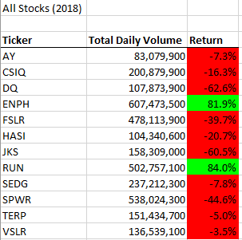
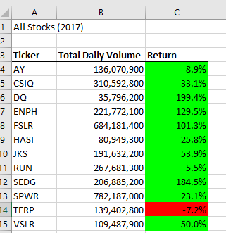
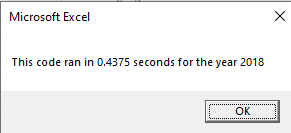
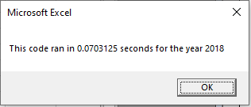
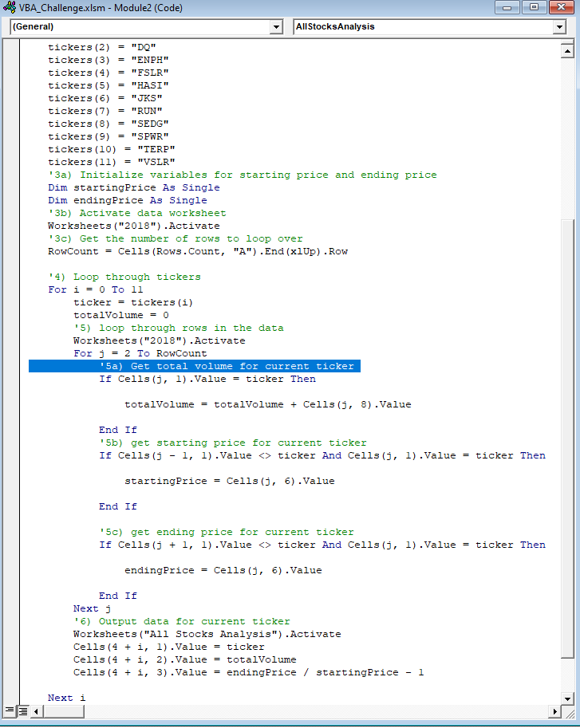
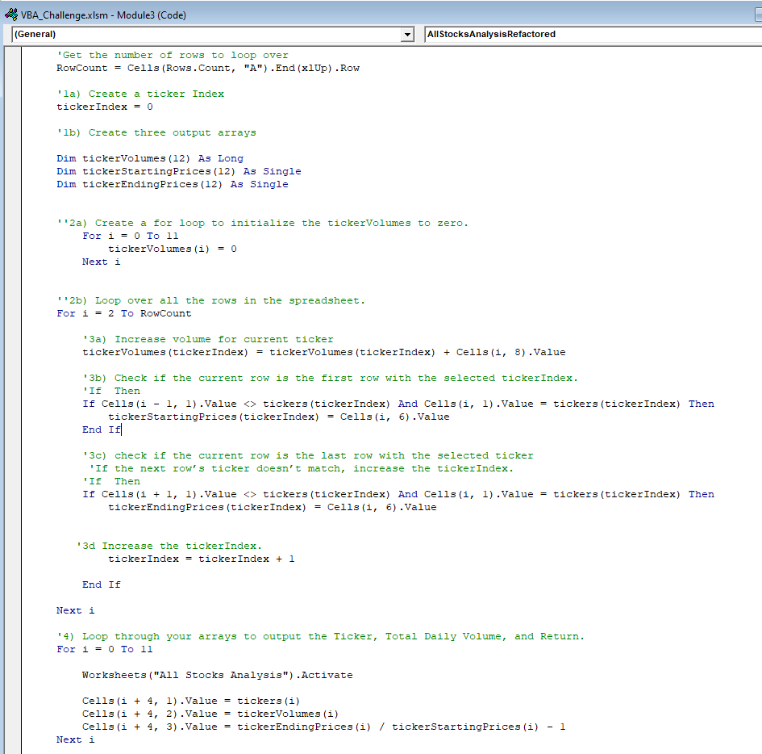

# stocks-analysis
## Overview of Project

This project aims to refractor a pre-made macro using VBA to examine the entire stock for Steve's parents over the last few years. The updated macro should based on the original code but upgrading it to higher level where the execution will be faster, even with large amount of data, as well as lower the use of memory. 

## Results

As can be seen from these two tables, stock performance in 2017 is better than 2018 as the stocks show positive return with high percentage except the TERP ticker. On the other hand, the stock in 2018 shows its down cycle as all of the stock return are negative; just only ENPH and RUN are still stable with positive percentage. 

The execution time in original code is 0.4375 while the refractor code is 0.0703125 which means the new code run much faster than the old one. It is because the new code reduce one if statement and has tickerIndex which lessen the work for the execution process.  

## Summary
### Advantage of refractoring
It will increase the possibility of upgrading the existing code (cleaner) as well as figuring out some bugs and code smell such as duplication, lack of design. 

### Disadvantage of refractoring
It takes time to complete the refractoring process. Meanwhile, it will create some problem during the progress. Moreover, the cost of upgrading the code is high so if the code runs effectively, people should not do it.

### How do these pros and cons apply to refractoring the original VBA script
It reduces the code lines (the if statement) after detecting some code smell,and make it well-organized which means the enhancement. The code executes straightforward to get the result as fast as possible so the execution time will be shorter. With large amount of data, this code reduce the waste time as well as the use of memory. 
However, refractoring a code might result in a mistake and it takes time. As I have spent more time rewriting the code compared to the original one. People should only refractor the code if they want to handle large amount of data. 

